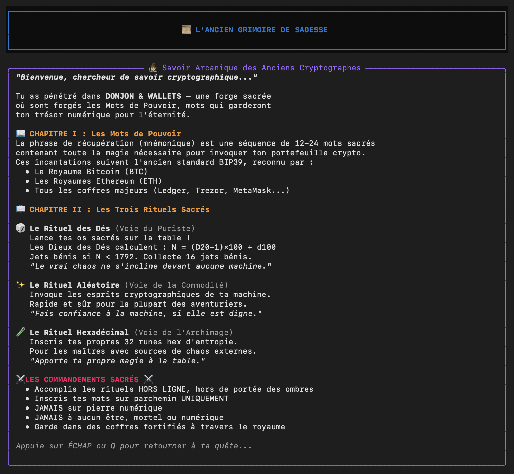
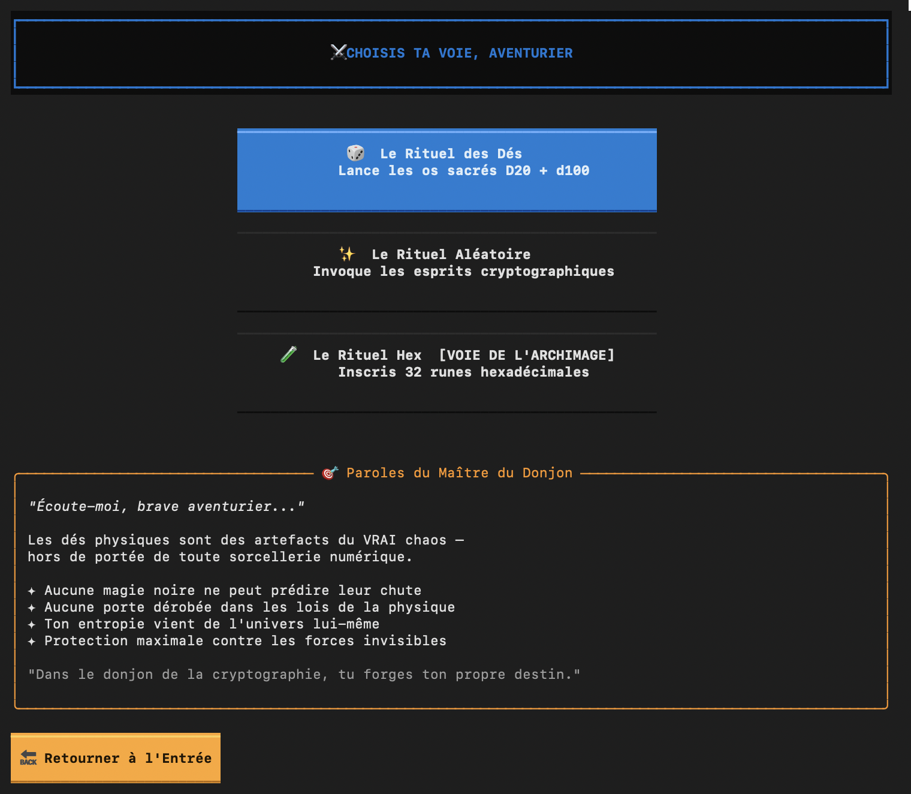
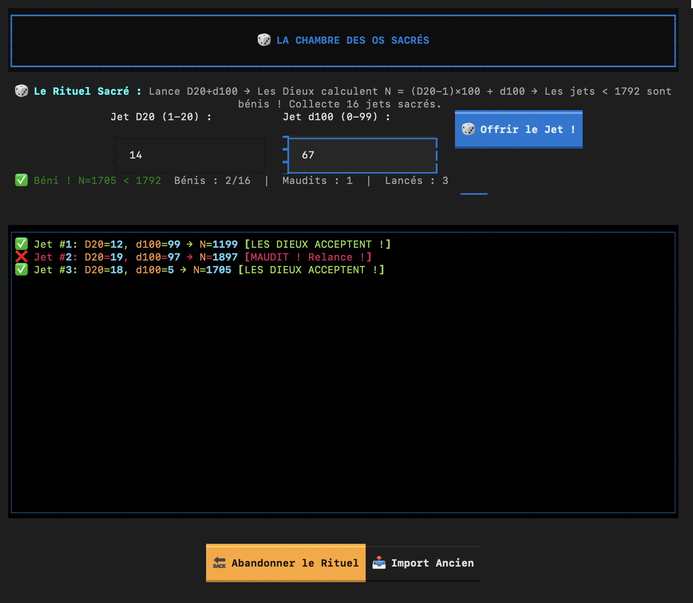
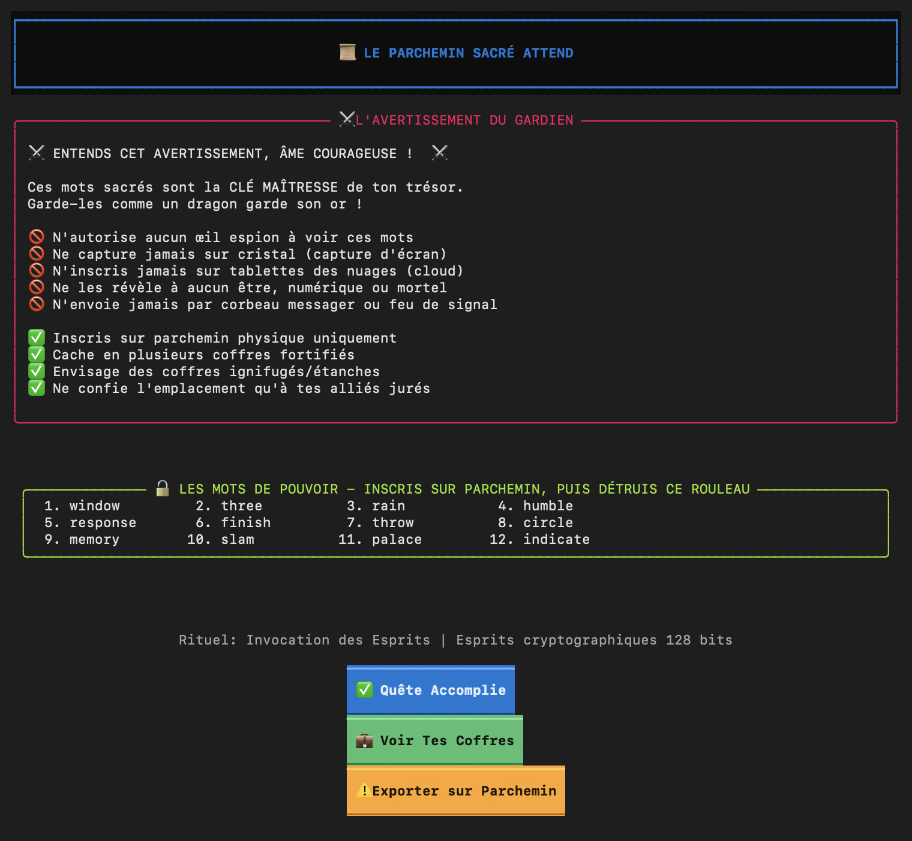
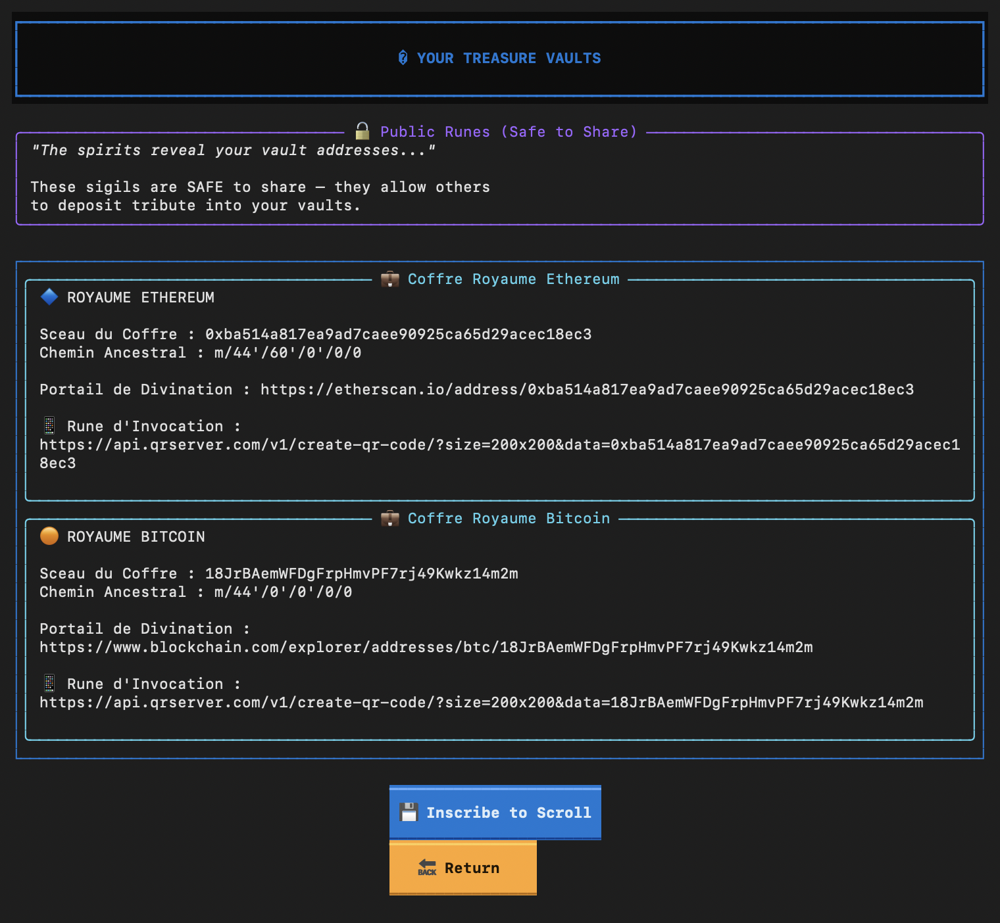

# Donjon & Wallet (D&W)

> 🎲 Lance les dés. Scelle ton destin. ⚔️

Application terminal thématique D&D pour générer des phrases mnémoniques BIP39 en toute sécurité.


## Résumé






### génération de seed avec 1 D20 et 1 D100




### Affichage des clefs publiques BTC ETH


## Installation

```bash
pip install textual rich
python dw_app.py
```

## Trois Rituels

| Rituel | Description |
|--------|-------------|
| 🎲 **Rituel des Dés** | Entropie via D20 + d100 physiques (recommandé) |
| ✨ **Rituel Aléatoire** | Générateur cryptographique du système |
| 🧪 **Rituel Hex** | Ta propre entropie (32 caractères hex) |

## Pourquoi les Dés Physiques ?

- ✦ Aucune vulnérabilité logicielle
- ✦ Aucune porte dérobée matérielle
- ✦ Entropie vérifiable
- ✦ Confiance maximale

## Sécurité

⚠️ **Pratiques essentielles :**

- Exécute **HORS LIGNE**
- Inscris sur **PAPIER uniquement**
- **Ne partage JAMAIS** ta phrase secrète
- **Jamais de capture d'écran**

## Structure

```
├── dw_app.py      # Application TUI Textual
├── core.py        # Fonctions entropie/mnémonique
├── english.txt    # Liste BIP39 (2048 mots)
└── screenshots/   # Captures d'écran
```

## Raccourcis

| Touche | Action |
|--------|--------|
| `Entrée` | Confirmer |
| `Échap` | Retour |
| `Tab` | Champ suivant |
| `Ctrl+Q` | Quitter |

## Licence

MIT.

---

# 🎲🎲🎲
